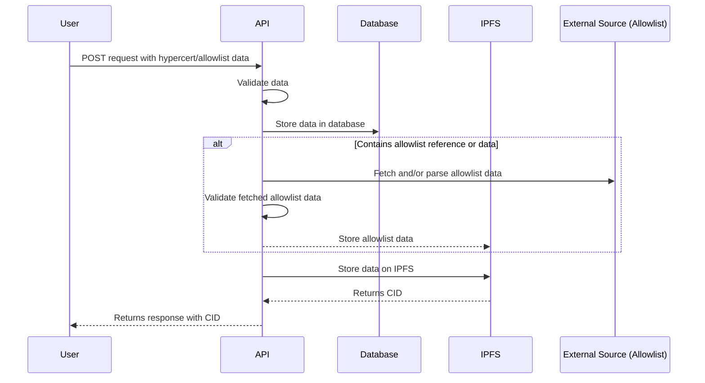
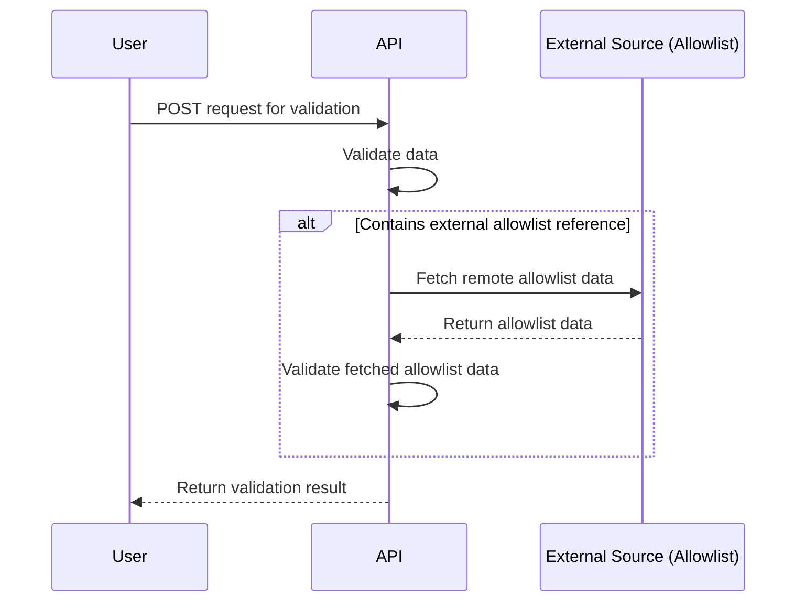
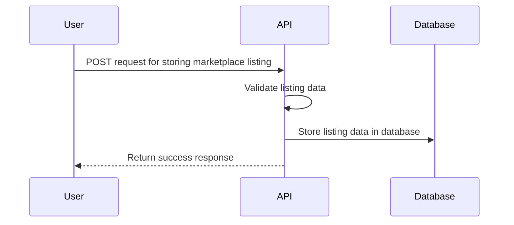

# Hypercerts API

The hypercerts API provides endpoints for storing, updating and querying hypercerts metadata, allowlist data, marketplace listings and user profiles. For a current overview of the implentation please review the OpenAPI specification on the [staging](https://staging-api.hypercerts.org/spec) or [production](https://api.hypercerts.org/spec) endpoints.

The API also includes a GraphQL endpoint and playground on the [staging](https://staging-api.hypercerts.org/v1/graphql) or [production](https://api.hypercerts.org/v1/graphql) endpoints. The schemas can be introspected by grapqhl clients like `urql`.

Code can be found in our [Github repository](https://github.com/hypercerts-org/hypercerts-api).

## REST API

The API provides endpoints for storing and verifying hypercert metadata, allowlists, marketplace listings, user profiles and more. 

### Storing data

When user submits a POST request for storing hypercert metadata or allowlist data, the API:

1. Validates the data
2. Stores the data in the database
3. Parses the data and fetches relevant data for storage
4. Stores the data on IPFS
5. Returns a response to the user containing the CID

> If the request contains references to allowlist data from an external source, the service will try to fetch and validate the remote allowlist data.

### Validating data

When a user submits a POST request for validation of a hypercert metadata or allowlist data, the API:

1. Validates the data
2. Returns the validation result

> If the request contains references to allowlist data from an external source, the service will try to fetch and validate the remote allowlist data.

### Storing marketplace listings

When a user submits a POST request for storing a marketplace listing, the API:

1. Validates the data
2. Stores the data in the database

## GraphQL

Our GraphQL API is powered by [`type-graphql`](https://typegraphql.com/) and [`graphql-yoga`](https://the-guild.dev/graphql/yoga-server).

The Yoga server is deployed on Railway and the schema can be introspected on the [staging](https://staging-api.hypercerts.org/v1/graphql) or [production](https://api.hypercerts.org/v1/graphql) endpoints. It exposes the schema as defined in the [hypercerts-api](https://github.com/hypercerts-org/hypercerts-api) repository. To build the schema we leverage `type-graphql` to define the types and resolvers.

Data is read from both our caching and storage databases and composed by the resolvers. Caching in our context implies all data that we store based on on-chain events. The storage database contains data like blueprints, user metadata and marketplace listings.

