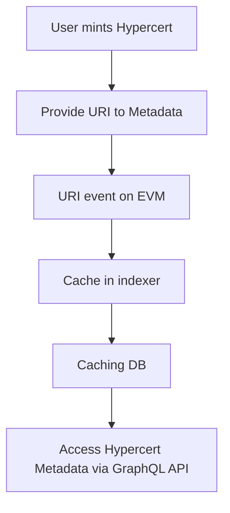

import Tabs from "@theme/Tabs";
import TabItem from "@theme/TabItem";

export const DataOverviewTable = () => {
    const evmData = [
        {object: "Attestations", storage: "Caching DB", purpose: "Quick access to EAS data"},
        {object: "Attestation schemas", storage: "Caching DB", purpose: "Quick access to EAS schemas"},
        {object: "Fractions", storage: "Caching DB", purpose: "Efficient query for fraction ownership and state"},
        {object: "Hypercerts", storage: "Caching DB", purpose: "Quick retrieval of hypercert data"},
        {object: "Sales", storage: "Caching DB", purpose: "Efficient query for sales"},
    ];

    const ipfsData = [
        {object: "Allowlists", storage: "Caching DB", purpose: "Efficient access to user allowlists"},
        {object: "Hypercert metadata", storage: "Caching DB", purpose: "Efficient metadata retrieval"},
        {object: "Hypercert images", storage: "Caching DB", purpose: "Quick retrieval of images for display"},
        {
            object: "Marketplace listings",
            storage: "Static DB",
            purpose: "Permanent storage of marketplace listings"
        },
    ];

    const otherData = [
        {object: "Blueprints", storage: "Static DB", purpose: "Permanent storage for marketplace blueprints"},
        {object: "User profiles", storage: "Static DB", purpose: "Long-term storage for user profile data"},
    ]

    const renderTable = (data) => (
        <table>
            <thead>
            <tr>
                <th>Data Object</th>
                <th>Storage Type</th>
                <th>Purpose</th>
            </tr>
            </thead>
            <tbody>
            {data.map((item, index) => (
                <tr key={index}>
                    <td>{item.object}</td>
                    <td>{item.storage}</td>
                    <td>{item.purpose}</td>
                </tr>
            ))}
            </tbody>
        </table>
    );

    return (
        <Tabs>
            <TabItem value="evm" label="EVM" default>
                {renderTable(evmData)}
            </TabItem>
            <TabItem value="ipfs" label="IPFS">
                {renderTable(ipfsData)}
            </TabItem>
            <TabItem value="other" label="Other">
                {renderTable(otherData)}
            </TabItem>
        </Tabs>
    );
}

# Data

Hypercerts represent a complex dataset that is distributed across multiple sources. When minting a hypercert, the creator must provide a URI to an object containing the hypercert data. Our default storage solution is IPFS, but the data object can be stored on any storage provider.

:::tip

Take permanence into account when providing the dataset. The hypercert metadata cannot be updated, so referencing any arbitrary domain name will most likely lead to a broken link in the future.

:::

## Overview

The following table gives an overview of the different data objects we maintain, their source, and where they are stored.

<DataOverviewTable/>

## Data Flow: Hypercert Minting and Access

## Retention

### Cached data

A database maintaining cached data is used to allow performant access to on-chain state and data stored on IPFS. The database is provided by Supabase and we rely on their backup solutions. In case the database goes down, all data can be restored from archival nodes and IPFS.

#### Local cache

On every environment the transactions parsed and data fetched from IPFS are cached in a Postgres database colocated with the indexer. The indexer is deployed on Railway and the schema can be introspected on the [staging](https://staging-api.hypercerts.org/v1/graphql) or [production](https://api.hypercerts.org/v1/graphql) endpoints.

### Static data

Static data like marketplace listing, blueprints and user profiles are stored in a separate database. Like the cached data, the database is provided by Supabase and we rely on their backup solutions.