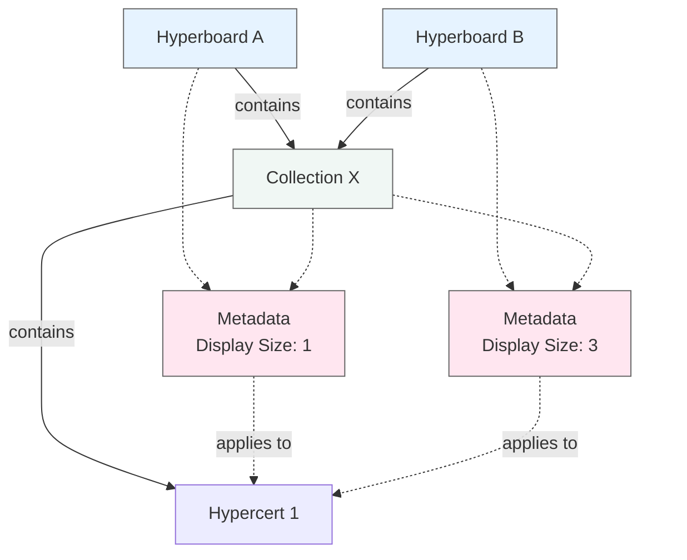

# Hyperboards

A hyperboard is the visualization of one or more collections. For more information on collections, and how to create a hyperboard/collection, see the [collections developer guide](/docs/developer/collections.md). For more information on why and when to use hyperboards see the [hyperboards user guide](/docs/guide/create-collection.mdx).

## Structure

A hyperboard consists of one or more collections. Each collection is a separate entity, and can be updated independently. This means that collections can be reused across multiple hyperboards. Metadata exists at the hyperboard level, so a hypercert in a hyperboard `hyperboard A` within collection `Collection A` can have a different display size than the same hypercert in the same collection in a different hyperboard `hyperboard B`.

This maximally diagram shows an example where:

- Two hyperboards (A and B) share a single collection (Collection X)
- Collection X contains a single hypercert
- The hypercert has a display size of 1 in Hyperboard A and a display size of 3 in Hyperboard B



In programmer terms, the primary key to metadata is `(hyperboard_id, collection_id, hypercert_id)`. This means that metadata is unique to the combination of a hyperboard, collection, and hypercert.

## Metadata and ownership calculation

The tiles on a hyperboard represent the ownership per address over all hypercerts and blueprints in the hyperboard. This relative weight of each hypercert or blueprint is calculated by the `display_size` metadata. In summary: the `display_size` metadata is what determines the real estate occupied by each hypercert or blueprint on the hyperboard, which is then divided amongst the owners of that hypercert or blueprint based on the amount of units they own.

### Example 1:

```
Hypercert A consists of 100 units, and has a display_size of 1 (33.33% of the hyperboard will be divided amongst the owners of Hypercert A, due to the display_size being 1)
Hypercert B consists of 100 units, and has a display_size of 2 (66.67% of the hyperboard will be divided amongst the owners of Hypercert B, due to the display_size being 2)
```

If an address owns 50 units of Hypercert A and 50 units of Hypercert B, the address will be displayed as owning 50% of the hyperboard.

| Hypercert | Board Space (display_size) | Total Units | Address Owns | Board % |
| --------- | -------------------------- | ----------- | ------------ | ------- |
| A         | 33.33% (1)                 | 100         | 50           | 16.67%  |
| B         | 66.67% (2)                 | 100         | 50           | 33.33%  |
| Total     | 100%                       |             |              | 50%     |

If an address owns 100 units of Hypercert A and 0 units of Hypercert B, the address will be displayed as owning 33.33% of the hyperboard.
| Hypercert | Board Space (display_size) | Total Units | Address Owns | Board % |
|-----------|---------------------------|-------------|--------------|----------|
| A | 33.33% (1) | 100 | 100 | 33.33% |
| B | 66.67% (2) | 100 | 0 | 0% |
| Total | 100% | | | 33.33% |

If an address owns 0 units of Hypercert A and 100 units of Hypercert B, the address will be displayed as owning 66.67% of the hyperboard.
| Hypercert | Board Space (display_size) | Total Units | Address Owns | Board % |
|-----------|---------------------------|-------------|--------------|----------|
| A | 33.33% (1) | 100 | 0 | 0% |
| B | 66.67% (2) | 100 | 100 | 66.67% |
| Total | 100% | | | 66.67% |

### Example 2:

```
Hypercert A consists of 1 unit, and has a display_size of 1 (50% of the hyperboard will be divided amongst the owners of Hypercert A, due to the display_size being 1)
Hypercert B consists of 10 units, and has a display_size of 1 (50% of the hyperboard will be divided amongst the owners of Hypercert B, due to the display_size being 1)
```

If an address owns 1 unit of Hypercert A and 0 units of Hypercert B, the address will be displayed as owning 50% of the hyperboard.

| Hypercert | Board Space (display_size) | Total Units | Address Owns | Board % |
| --------- | -------------------------- | ----------- | ------------ | ------- |
| A         | 50% (1)                    | 1           | 1            | 50%     |
| B         | 50% (1)                    | 10          | 0            | 0%      |
| Total     | 100%                       |             |              | 50%     |

If an address owns 0 units of Hypercert A and 5 units of Hypercert B, the address will be displayed as owning 25% of the hyperboard.

| Hypercert | Board Space (display_size) | Total Units | Address Owns | Board % |
| --------- | -------------------------- | ----------- | ------------ | ------- |
| A         | 50% (1)                    | 1           | 0            | 0%      |
| B         | 50% (1)                    | 10          | 5            | 25%     |
| Total     | 100%                       |             |              | 25%     |

## Developer guide

The hyperboard widget lives in the [hyperboards repo](https://github.com/hypercerts-org/hyperboards). The widget is a React component that can be embedded in any website. For more information on how to use the widget, see the [hyperboards user guide](/docs/guide/create-collection.mdx). It's a static JS bundle that is built on every push to the repo, and then hosted from the nextjs public folder.

This diagram shows:

- Two different hyperboards (A and B)
- Collection A being reused across both hyperboards
- Different display sizes for the same hypercerts in different hyperboards (note Hypercert 1 has display_size 1 in Hyperboard A but display_size 3 in Hyperboard B)
- Metadata existing at the hyperboard level (shown in pink)
- Collections can contain multiple hypercerts and hypercerts can belong to multiple collections
