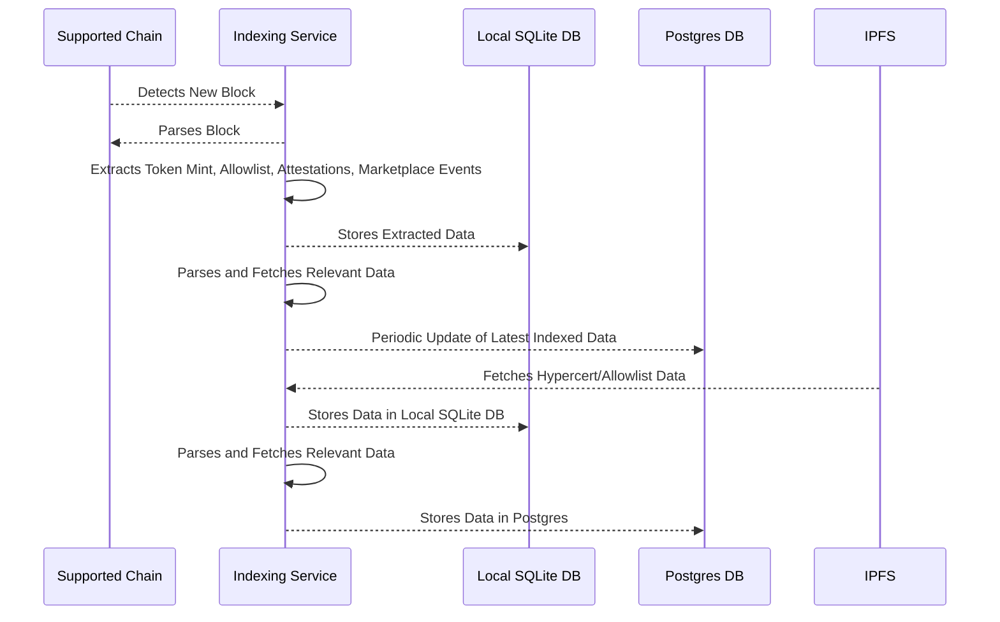

# Hypercerts indexer

The indexer is a service that parses events from the blockchain and stores the data in a database. It is used to provide a GraphQL API for read access to the data. The indexer is deployed on Railway and data can be read on the [staging](https://staging-api.hypercerts.org/v1/graphql) or [production](https://api.hypercerts.org/v1/graphql) endpoints.

Code can be found in our [Github repository](https://github.com/hypercerts-org/hypercerts-indexer).

## Indexing service

The indexing service is a node server that continuously runs and parses event data from supported chains. At the core, the service wraps our fork of [chainsauce](https://github.com/hypercerts-org/hypercerts-chainsauce) with additional indexing logic for our use cases.

When a new block is detected on a supported chain, the service:

1. Parses the block and extracts relevant data such as token mint events, allowlist mint events, attestations,and marketplace events.
2. Stores the extracted data in a local SQLite database for quick access.
3. Parses the data and fetches relevant data for storage.
4. Periodically, the service updates the Postgres database with the latest indexed data.

Additionally, when a new hypercert or allowlist is created, the service:

1. Fetches the data from IPFS.
2. Stores the data in the local SQLite database.
3. Parses the data and fetches relevant data for storage.
4. Stores the data in the Postgres database.

